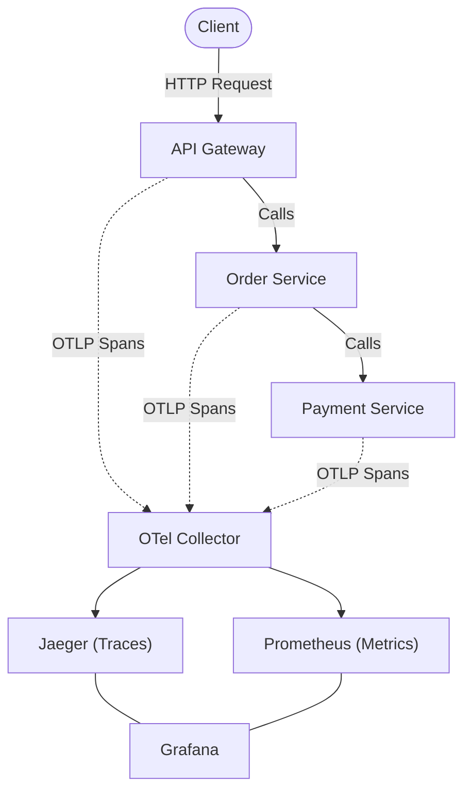

# Architecture — opentelemetry-microservice-demo
> Last updated: 2026-08-29 | Maturity: Partial Prototype
> _OpenTelemetry tracing across Node.js microservices._

## System Diagram
The following Mermaid.js sequence diagram maps the core workflow and interactions:

## Component Table

| Component | File | Responsibility | Tech |
|---|---|---|---|
| API Gateway | `services/api-gateway/` | Entrypoint | Node.js / Express |
| Microservices | `services/` | Business logic | Node.js |
| Collector | `otel-collector/config.yaml`| Telemetry pipeline | OTel Collector |

## Dependency Honesty Table

| Dependency | Status | Notes |
|---|---|---|
| OpenTelemetry | **Real** | Real SDK instrumentation and collector export. |
| Datastores | **Simulated** | Jaeger and Prometheus store data purely locally in memory/disk. |

## The Three Pillars of Observability
OpenTelemetry unifies all three signals under one SDK:
1. **Traces**: Follow a single request across all 3 services (API Gateway → Order Service → Payment Service)
2. **Metrics**: HTTP request duration, error rates, and custom business metrics
3. **Logs**: Structured logs correlated with trace IDs

## OTel Collector Architecture
The Collector is the critical piece. Rather than each service exporting directly to Jaeger/Prometheus, they all export to the Collector via OTLP. The Collector then fans out to multiple backends. This means:
- Adding a new backend (e.g., Datadog) requires zero code changes
- Sampling, filtering, and enrichment happen at the Collector level
- Services don't need network access to every backend

## Context Propagation
When API Gateway calls Order Service via HTTP, OpenTelemetry automatically injects trace context headers (`traceparent`). Order Service picks them up and continues the same trace. This produces a single distributed trace spanning all 3 services — the core value proposition of OTel.